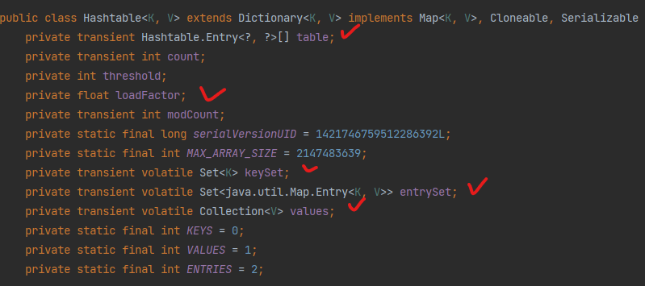
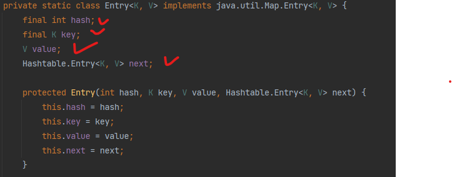

# Hashing

# What is Hashing?

- `A technique used for storing and retrieving information as quickly as possible`
- `The process of mapping the keys to locations`
- Hashing = Hash function + Hash Table(Hash Map)

# Why using Hashing?

- O(1) in insert, delete, search on average
- In worst case : O(n)

# When to Use?
- Of course, when we want insert, delete, search as quickly as possible
- Where number of possible keys are big

# How is it called in Programming Language?

- HashTable, HashMap, Dictionary

# HashTable ADT

- Create HashTable
- Search key
- Insert key
- Delete key
- Delete Hash Table

# Understanding Hashing

- Case1: Think about an example where we find first repeated character in a given word
    - Solution would be to `create an array with size of ASCII code`, set all values with 0
    - As we iterate each string character, add values or return character that is repeated first
- Case2: What if it is to find first repeated number in a give number?
    - Solution above is not going to work because numbers are infinite
    - `We cannot create an array with infinite size and storing counters`
    - We need to somehow map all these possible keys to the possible memory locations

# Components of hashing

1. Hash Table
2. Hash Function
3. Collisions
4. Collision Resolution Techniques

# Hash Table

- Problem with array
    - With array, we `store element whose key is k at a position k`
        - Given a key k, `we find element whose key is k at k position`
        - `This is called direct addressing`
        - `It is possible when we have enough space to allocate all possible keys and elements`

- Hash Table? Hash Map?
    - A Data structure that stores keys and its values
    - `Hash Table uses a hash function to map keys to values`
    - We use Hash table when number of keys stored is small relative to the number of possible keys

- Key + Hash Function + Hash + Value + Bucket(or Slot)

# Hash Function

- `Used to transform the key into the index`
- key :point_right: Hash Function :point_right: index
- Ideally, it should map each key into a unique index...
    - This is called perfect hash function
- Goal of creating hash function
    - Minimize the number of collisions,
    - Easy to computer
    - Evenly distribute the elements

# How does Hash Table work?

1. Hash function takes key as a parameter
2. Hash function then convert key into a Hash
3. This Hash(or Hash value), mapped with value, is stored in bucket

## How to choose Hash Function?

1. It distributes the index values uniformly across the table
2. Collision resolution algorithm should compute alternative index
3. Fast, return values in range of table, minimize collision

## Good Hash Function?

- Less collision
- Easy and quick
- Distribute key values evenly
- High load factor

# Collision

- Once again, Hash Functions are used to map each key to a different address space.
- However, it is not possible because
    - Almost converting infinite number of possible keys into finite hash values is not possible

## What is collision?

- It is a condition where Hash value derives from more than one key

## Collision Resolution Techniques

- Process of finding alternative location

- Direct Chaining
    - An Array of linked list application
    - Separate chaining
        - Make bucket linked list so that every time collision occurs, value is stored next to previous one
        - Things to notice
            - Put less weight on choosing good hash function
            - Values don't have to be either skipped or removed
            - Consumption of relative less memory: No need to pre-occupy space
            - Bucket can be skewed to certain slots

        - Big O notation
            - Insertion: O(1) if inserted at head, O(n) if inserted at tail
            - Deletion & Search: O(n) since it has to look through linked list

- Open Addressing
    - Array-based implementation
    - `Find empty Hash while Separate chaining keeps same hash`
    - 1 Hash, 1 value
    - `Methodologies below based on how each finds an empty hash`

    1. Linear Probing
        - Find next(+1) hash or +nth hash to check and store value
    2. Quadratic Probing
        - Square of hash and store data
    3. Double Hashing

    - Create hash by running another hash function and store data

    - Things to notice
        - Choosing good hash function does matter
        - No other additional space
    
    - Big O notation
        - Insertion, Deletion, Search: O(1) on average, O(n) on worst case
    

# Things to review before using hash table
1. Hash table does not guarantee orders
2. Need pre-allocated space
3. Having good hash function is matters a lot

# Internals of Hash Table in Java

- `Array of HashTable.Entry`, How does it look like?

- We can identify that it contains hash, key, value and next(meaning it's implemented in separate chaining)

# Links

[Data Structure and Algorithms - Hash Table](https://www.tutorialspoint.com/data_structures_algorithms/hash_data_structure.htm)
[Hash Table](https://velog.io/@cyranocoding/Hash-Hashing-Hash-Table%ED%95%B4%EC%8B%9C-%ED%95%B4%EC%8B%B1-%ED%95%B4%EC%8B%9C%ED%85%8C%EC%9D%B4%EB%B8%94-%EC%9E%90%EB%A3%8C%EA%B5%AC%EC%A1%B0%EC%9D%98-%EC%9D%B4%ED%95%B4-6ijyonph6o)
